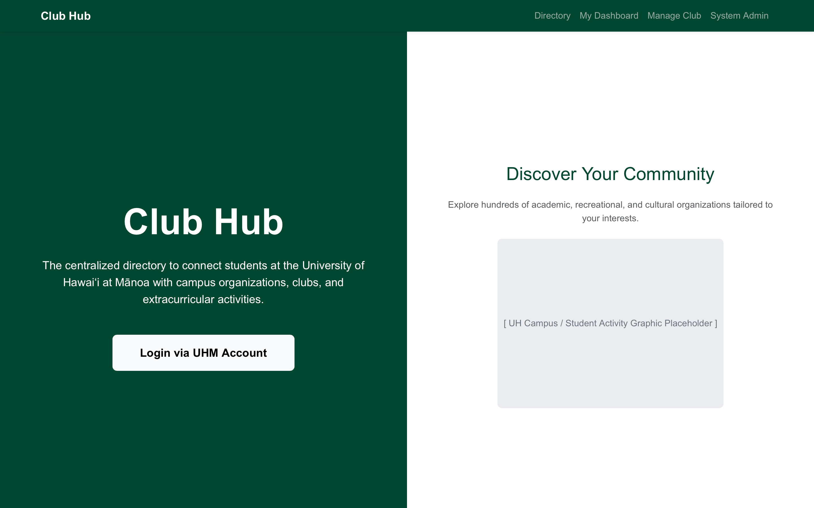
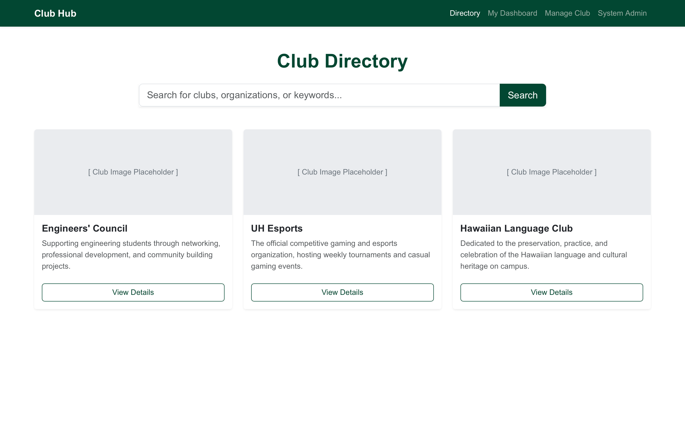
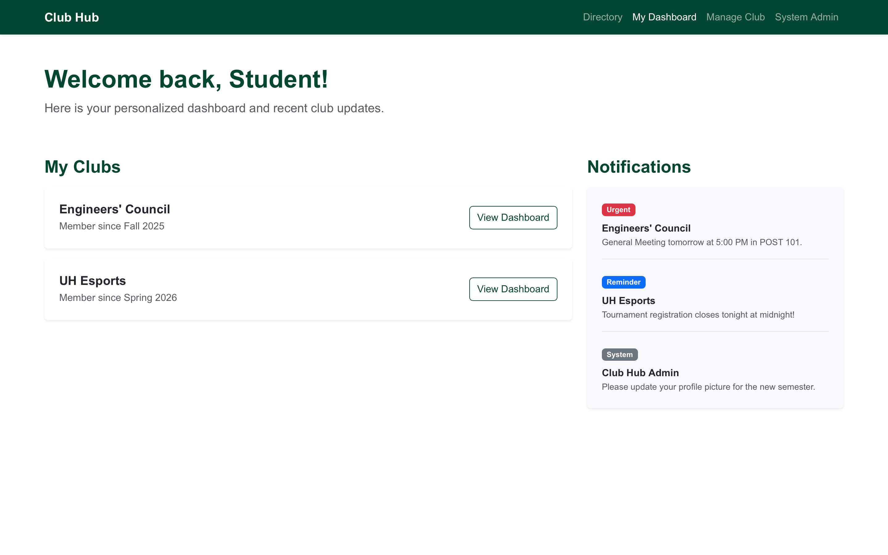
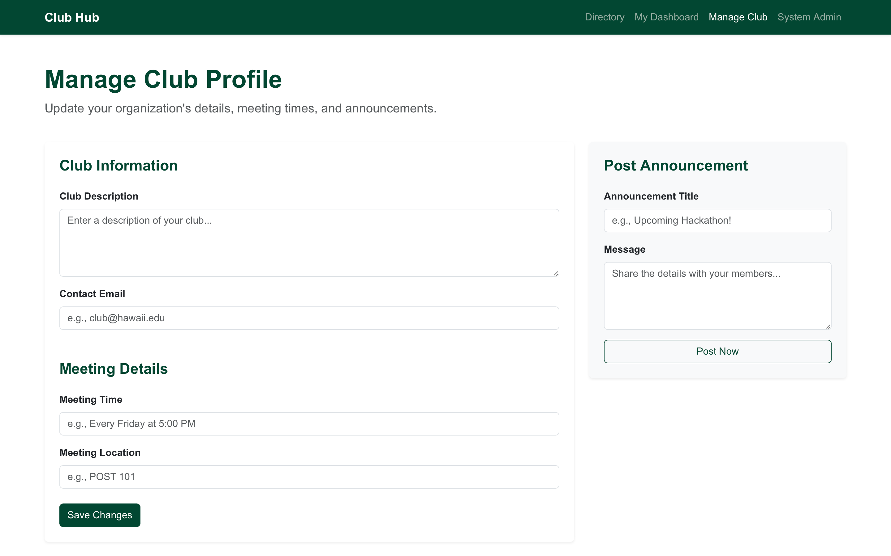

## Overview
Club Hub is a centralized directory application designed to connect students at the University of Hawaiʻi at Mānoa with campus organizations, clubs, and extracurricular activities.

## The Problem
Currently, discovering and joining student organizations at UHM can be a frustrating and fragmented experience. Information is often scattered across outdated university web pages, various social media platforms, or physical flyers on campus bulletin boards. For new or transfer students, this lack of a centralized, easily searchable database makes it difficult to find communities that align with their specific academic, cultural, or personal interests. Furthermore, club administrators struggle to maintain visibility and keep their contact information updated for prospective members.

## The Solution
Club Hub solves this by providing a unified, interactive directory tailored specifically for the UHM community. The application will allow students to filter and search for registered organizations based on predefined interest tags (e.g., "Engineering", "Arts", "Outdoors", "Professional").

### Key Features
*   **Role-Based Access:** Distinct roles for regular students, club administrators, and system admins.
*   **Tag-Based Filtering:** A robust search system allowing users to find clubs matching their personal profiles.
*   **Profile Management:** Club administrators can easily log in to update their organization’s description, meeting times, and contact information, ensuring the directory remains current without relying on a central webmaster.

## Mockups
*(Note: I will replace these descriptions with actual UI sketches or wireframes as the design phase progresses).*

### Landing Page
A clean, welcoming entry point explaining the purpose of Club Hub with a prompt to log in via a UHM account.
<!-- Add your image link below this line, e.g.,  -->

### Directory / Search Page
The core feature page displaying a grid of club cards. Includes a sidebar with dropdown menus to filter by categories (e.g., Academic, Recreational, Cultural).
<!-- Add your image link below this line, e.g.,  -->

### User Profile Page
A dashboard where students can set their personal interest tags and see a list of bookmarked or recommended clubs.
<!-- Add your image link below this line, e.g.,  -->

### Club Admin Dashboard
A form-based page where designated club officers can edit their club’s public profile and update announcements.
<!-- Add your image link below this line, e.g.,  -->

## Use Cases
*   **New Student Discovery:** A freshman logs in, sets their interests to "Software Engineering" and "Hiking," and the system instantly filters the directory to show relevant organizations.
*   **Club Officer Update:** A club president logs in, navigates to their organization’s page, and updates the meeting location for the upcoming semester. The changes are immediately reflected in the public directory.
*   **System Administration:** A site admin logs in to review newly registered clubs, approve them for public display, and remove any obsolete or duplicate entries.

## Technical Stack
Building upon modern web development standards, the project will utilize:
*   **Frontend:** React and Next.js for a responsive, component-based user interface.
*   **Styling:** Bootstrap 5 for rapid UI prototyping and consistent mobile-friendly layout.
*   **Backend/Database:** PostgreSQL to securely manage user profiles, club data, and the relational mapping of interest tags.
*   **Language:** Strict TypeScript to ensure type safety and minimize runtime errors throughout the application.
