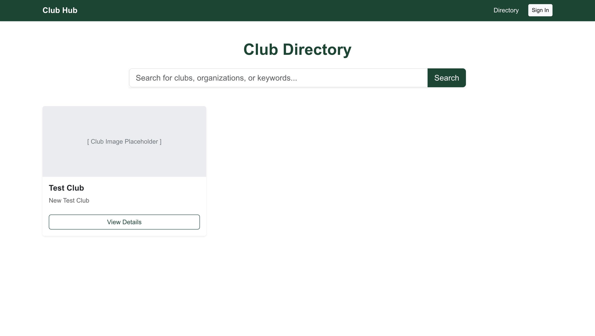
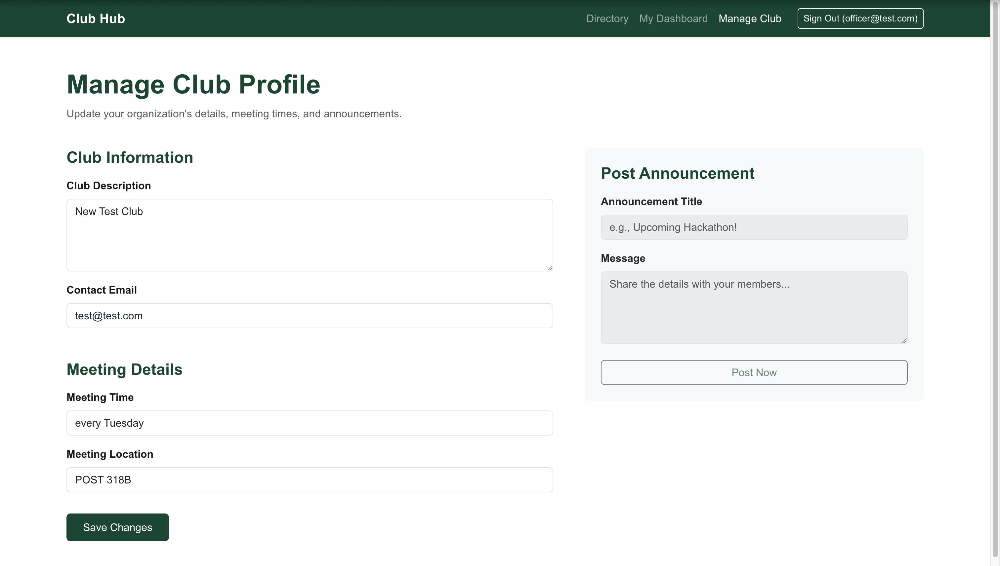
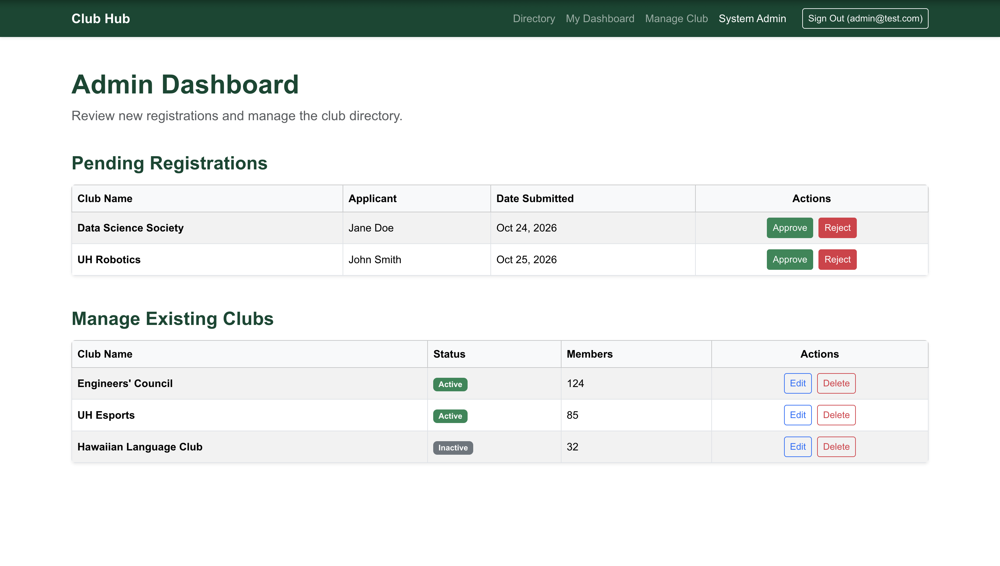
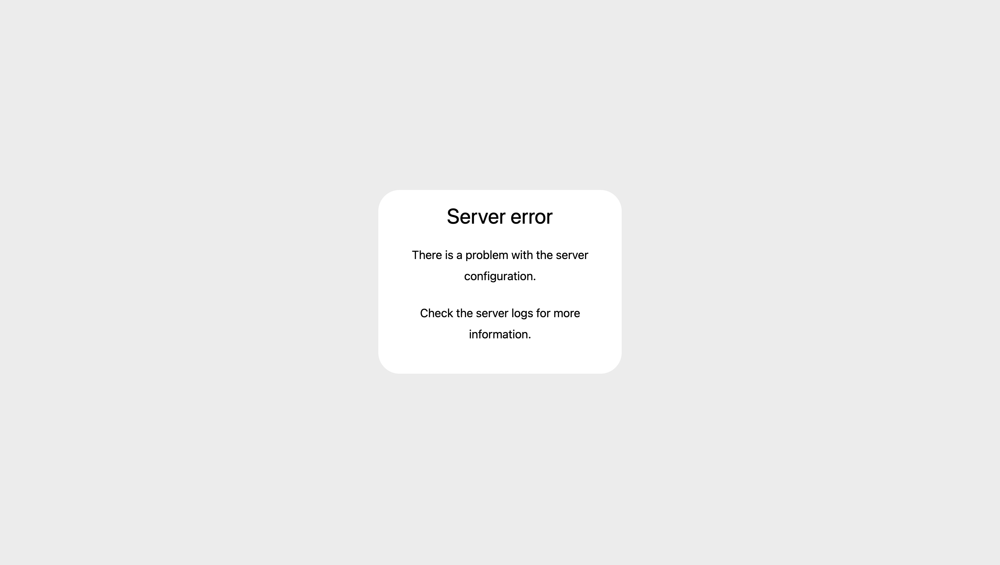

## Table of contents

* [Overview](#overview)
* [Project Links](#project-links)
* [Deployment](#deployment)
* [Project Management](#project-management)
* [Developer Guide](#developer-guide)
* [The Problem and Solution](#the-problem-and-solution)
* [User Guide](#user-guide)
* [Use Cases](#use-cases)
* [Technical Stack](#technical-stack)
* [Team](#team)

## Overview
Club Hub is a centralized directory application designed to connect students at the University of Hawaiʻi at Mānoa with campus organizations, clubs, and extracurricular activities.

Users can either view the current catalog of UH Manoa campus clubs, or login to view or edit their personally curated roster of clubs.

## Project Links
* **[GitHub Organization & Repositories](https://github.com/uhm-club-hub)**
  * **[Project Homepage Repository](https://github.com/uhm-club-hub/uhm-club-hub.github.io)**
  * **[Next.js Application Repository](https://github.com/uhm-club-hub/club-hub)**
* **[Team Contract](https://docs.google.com/document/d/1y0JX6MKeQL0HboowJPYuj7kNQpnwa3ZX2jyb8Xzgsqs/edit?usp=sharing)** 

## Deployment
Our application is actively being developed and is deployed via Vercel.
* **[View Club Hub Live on Vercel](https://club-hub-nu.vercel.app)**

## Project Management
We use Issue Driven Project Management (IDPM) to track our progress.
* **[Milestone 1 (M1) Project Board](https://github.com/orgs/uhm-club-hub/projects/1/views/1)**: Displays the issues completed for this milestone. (Note: All M1 issues have estimates/actuals, and nothing remains in Backlog or In Progress).
* **[Milestone 2 (M2) Project Board](https://github.com/orgs/uhm-club-hub/projects/2/views/1)**: Displays the issues completed for this milestone. (Note: All M2 issues have estimates/actuals, and nothing remains in Backlog or In Progress).
* **[Milestone 3 (M3) Project Board](https://github.com/orgs/uhm-club-hub/projects/4/views/1)**: Outlines the issues and goals we plan to address in the final phase of development, including real data integration and acceptance testing.

## Developer Guide

1. Install [PostgreSQL](https://www.postgresql.org/download/)
 
2. Clone the repo on Github. Open in a code editor of your choice, like VSCode.
  
3. Install dependencies:
```
npm install
```
 
4. Create your `.env` file and update `DATABASE_URL`.
```
# Edit to match your system: username, password, port-number
DATABASE_URL="postgresql://<USERNAME>:<PASSWORD>@localhost:5432/clubhub?schema=public"

AUTH_SECRET=<YOUR_AUTH_SECRET_HERE>

AUTH_URL=http://localhost:3000
```
  
5. Run migrations and generate the Prisma client:
```
npx prisma migrate dev
```
```
npx prisma generate
```
5.5. Run this command in case you need to reset your database:
```
npx prisma migrate reset
```
 
6. Seed the database:
```
npx prisma db seed
```
 
7. Start the dev server, and the application should run at 'http://localhost:3000':
```
npm run dev
```

---

## The Problem and Solution

### The Problem
Currently, discovering and joining student organizations at UHM can be a frustrating and fragmented experience. Information is often scattered across outdated university web pages, various social media platforms, or physical flyers on campus bulletin boards. For new or transfer students, this lack of a centralized, easily searchable database makes it difficult to find communities that align with their specific academic, cultural, or personal interests. Furthermore, club administrators struggle to maintain visibility and keep their contact information updated for prospective members.

### The Solution
Club Hub solves this by providing a unified, interactive directory tailored specifically for the UHM community. The application will allow students to filter and search for registered organizations based on predefined interest tags (e.g., "Engineering", "Arts", "Outdoors", "Professional").

### Key Features
*   **Role-Based Access:** Distinct roles for regular students, club administrators, and system admins.
*   **Tag-Based Filtering:** A robust search system allowing users to find clubs matching their personal profiles.
*   **Profile Management:** Club administrators can easily log in to update their organization’s description, meeting times, and contact information, ensuring the directory remains current without relying on a central webmaster.

---

## User Guide

## Current State & Screenshots
*(Note: As part of Milestone 2, the following screenshots reflect the current state of our deployed application.)*

### Landing Page
A clean, welcoming entry point explaining the purpose of Club Hub with a prompt to log in via a UHM account. 
<!-- 确保放入实际网页的截图，M1要求有Landing page并且包含登录入口 -->


### Directory / Search Page
The core feature page displaying a grid of club cards. Includes a sidebar with dropdown menus to filter by categories.


### Sign In Page / Sign In Error
A page for users to sign into with their UH Manoa email. Includes an error message if sign in attempt fails.


### Landing Page for Student Users
If users sign in as a Student, they will have access to their dashboard.
*(Note: Depending on your account's role, you will be allowed to access more in regards to if you're in a club(s) and your status within said club(s).)*


### User Profile Page
A dashboard where students can set their personal interest tags and see a list of bookmarked or recommended clubs.


### Landing Page for Officer Users
If users sign in as a Officer, they will have access to editing their club's public profile.


### Club Admin Dashboard
A form-based page where designated club officers can edit their club’s public profile and update announcements.


### Landing Page for Admin Users
If users sign in as a Officer, they will have access to reviewing and managing their clubs.


### System Admin Page 
A dashboard for site admins to review newly registered clubs, approve them for public display, and manage entries.


### Server Error Page
An error message page for whenever a server error occurs.


---

## Use Cases
*   **New Student Discovery:** A freshman logs in, sets their interests to "Software Engineering" and "Hiking," and the system instantly filters the directory to show relevant organizations.
*   **Club Officer Update:** A club president logs in, navigates to their organization’s page, and updates the meeting location for the upcoming semester. The changes are immediately reflected in the public directory.
*   **System Administration:** A site admin logs in to review newly registered clubs, approve them for public display, and remove any obsolete or duplicate entries.

## Technical Stack
Building upon modern web development standards, the project utilizes:
*   **Frontend:** React and Next.js for a responsive, component-based user interface.
*   **Styling:** Bootstrap 5 for rapid UI prototyping and consistent mobile-friendly layout.
*   **Backend/Database:** PostgreSQL to securely manage user profiles, club data, and the relational mapping of interest tags.
*   **Language:** Strict TypeScript to ensure type safety and minimize runtime errors throughout the application.

## Team
Club Hub is designed, implemented, and maintained by [Peili Zhu](https://github.com/zhupeili-uh), [Erika Penullar](https://github.com/E-Penullar), and [Robyn Morita](https://github.com/rmorita2).
