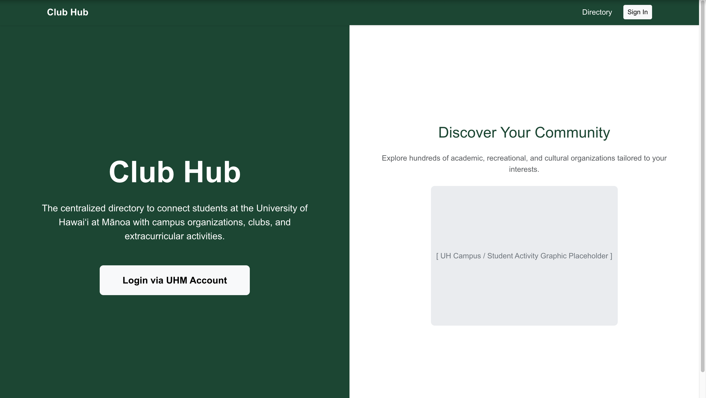
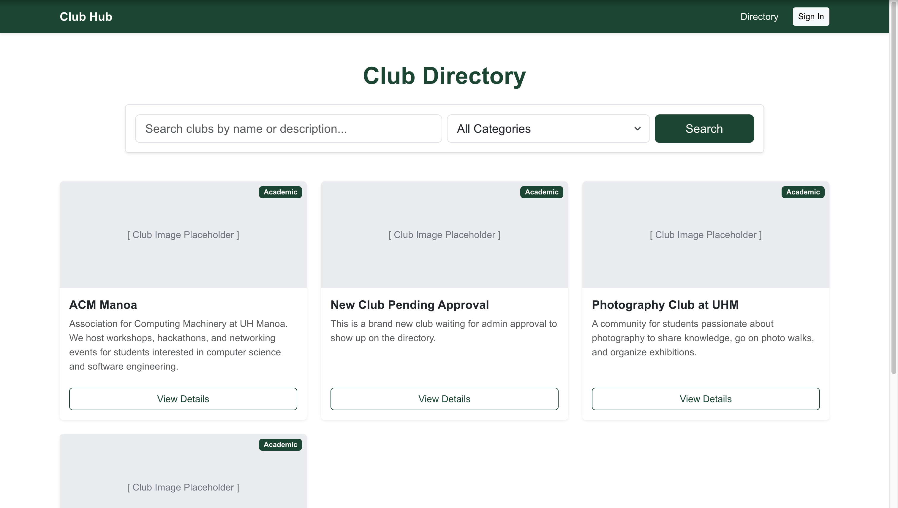
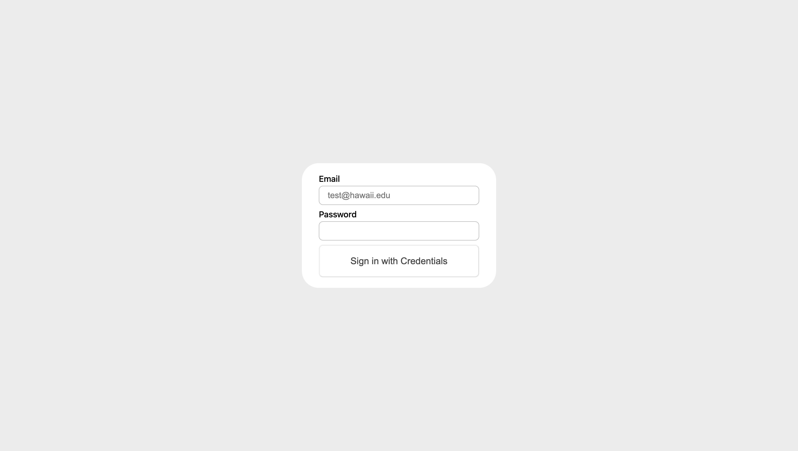
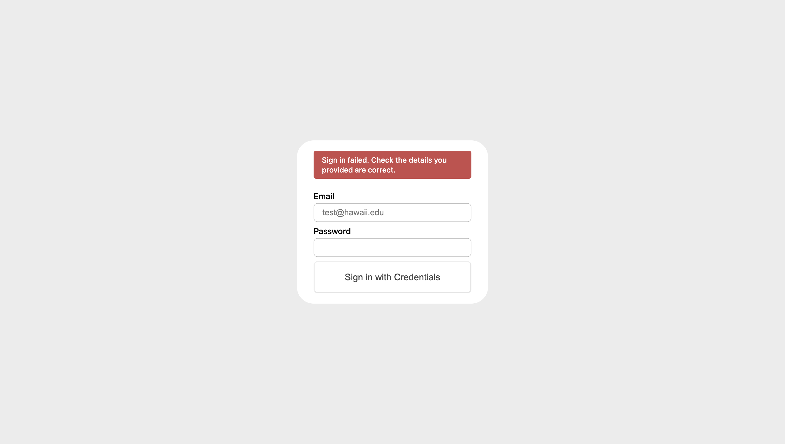
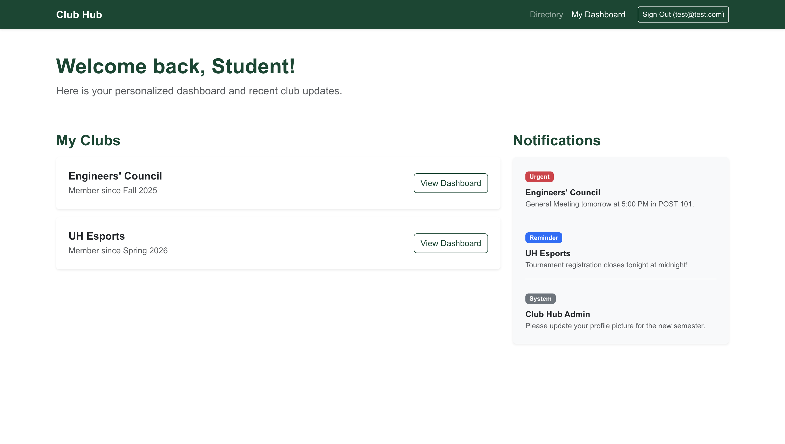
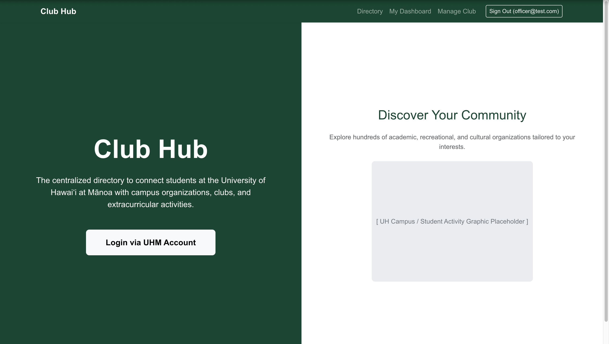
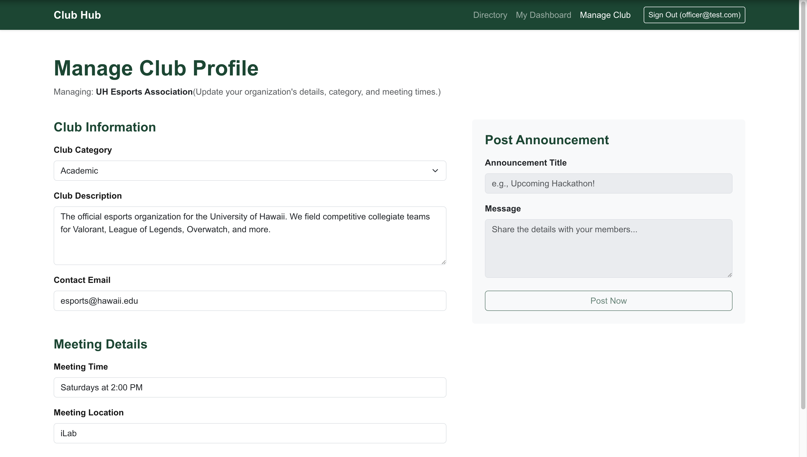
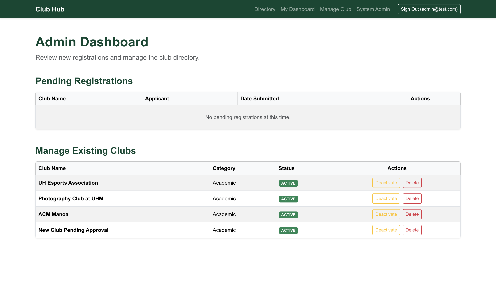

## Table of contents

* [Overview](#overview)
* [Project Links](#project-links)
* [Deployment](#deployment)
* [Project Management](#project-management)
* [Developer Guide](#developer-guide)
* [The Problem and Solution](#the-problem-and-solution)
* [User Guide](#user-guide)
* [Constructive Feedback](#constructive-feedback)
* [Use Cases](#use-cases)
* [Technical Stack](#technical-stack)
* [Team](#team)

## Overview
Club Hub is a centralized directory application designed to connect students at the University of Hawaiʻi at Mānoa with campus organizations, clubs, and extracurricular activities.

Users can either view the current catalog of UH Manoa campus clubs, or login to view or edit their personally curated roster of clubs.

## Project Links
* **[GitHub Organization & Repositories](https://github.com/uhm-club-hub)**
  * **[Project Homepage Repository](https://github.com/uhm-club-hub/uhm-club-hub.github.io)**
  * **[Next.js Application Repository](https://github.com/uhm-club-hub/club-hub)**
* **[Team Contract](https://docs.google.com/document/d/1y0JX6MKeQL0HboowJPYuj7kNQpnwa3ZX2jyb8Xzgsqs/edit?usp=sharing)** 

## Deployment
Our application is actively being developed and is deployed via Vercel.
* **[View Club Hub Live on Vercel](https://club-hub-nu.vercel.app)**

## Project Management
We use Issue Driven Project Management (IDPM) to track our progress.
* **[Milestone 1 (M1) Project Board](https://github.com/orgs/uhm-club-hub/projects/1/views/1)**: Displays the issues completed for this milestone. (Note: All M1 issues have estimates/actuals, and nothing remains in Backlog or In Progress).
* **[Milestone 2 (M2) Project Board](https://github.com/orgs/uhm-club-hub/projects/2/views/1)**: Outlines the issues and goals we plan to address in the next phase of development.
* **[Milestone 3 (M3) Project Board](https://github.com/orgs/uhm-club-hub/projects/4)**: Tracks the issues, assignments, and development progress planned for the third phase of the project.

---

## Developer Guide

1. Install [PostgreSQL](https://www.postgresql.org/download/)

2. Clone the repo on Github. Open in a code editor of your choice, like VSCode.

3. Install dependencies:
```
npm install
```

4. Create your '.env' file and update 'DATABASE_URL':
```
# Edit to match your system: username, password, port-number
DATABASE_URL="postgresql://<USERNAME>:<PASSWORD>@localhost:5432/clubhub?schema=public"

AUTH_SECRET=<YOUR_AUTH_SECRET_HERE>

AUTH_URL=http://localhost:3000
```

5. Run migrations and generate the Prisma client:
```
npx prisma migrate dev
```
```
npx prisma generate
```
*Run this command in case you need to reset your database:*
```
npx prisma migrate reset
```

6. Seed the database:
```
npx prisma db seed
```

7. Start the dev server, and the application should run at 'http://localhost:3000':
```
npm run dev
```

---

## The Problem and Solution

### The Problem
Currently, discovering and joining student organizations at UHM can be a frustrating and fragmented experience. Information is often scattered across outdated university web pages, various social media platforms, or physical flyers on campus bulletin boards. For new or transfer students, this lack of a centralized, easily searchable database makes it difficult to find communities that align with their specific academic, cultural, or personal interests. Furthermore, club administrators struggle to maintain visibility and keep their contact information updated for prospective members.

### The Solution
Club Hub solves this by providing a unified, interactive directory tailored specifically for the UHM community. The application will allow students to filter and search for registered organizations based on predefined interest tags (e.g., "Engineering", "Arts", "Outdoors", "Professional").

### Key Features
*   **Role-Based Access:** Distinct roles for regular students, club administrators, and system admins.
    * Users are put into 3 different roles: Student (general or casual users / club members), Officer (club officer of a club / multiple clubs), and Admin (site administrators)
*   **Tag-Based Filtering:** A robust search system allowing users to find clubs via filtering by category.
*   **Profile Management:** Club officers can easily log in to update their organization’s description, meeting times, and contact information, ensuring the directory remains current without relying on a central webmaster.

---

## User Guide

## Current State & Screenshots
*(Note: As part of Milestone 3, the following screenshots reflect the current state of our deployed application.)*

### Landing Page
A clean, welcoming entry point explaining the purpose of Club Hub with a prompt to log in via a UHM account. 


### Directory / Search Page
The core feature page displaying a grid of club cards. Includes a function with dropdown menus to filter by categories.


### Sign In Page / Sign In Error
A page for users to sign into with their UH Manoa email. Includes an error message if sign in attempt fails.



*(Note: As part of Milestone 3, a sign up page has not been implemented, however there are test accounts that can be used below:)*
* email: admin@test.com, password: admin user)
* email: officer@test.com, password: officer user)
* email: test@test.com, password: student user)

### Landing Page for Student Users
If users sign in as a Student, they will have access to their personal dashboard.
*(Note: Depending on your account's role, you will be allowed to access more in content and settings.)*


### User Profile Page
A dashboard where students can see a list of clubs they are members of and club / user notifications.


### Landing Page for Officer Users
If users sign in as a Officer, they will have access to editing their club's public profile.


### Club Admin Dashboard
A form-based page where designated club officers can edit their club’s public profile and update announcements.


### Landing Page for Admin Users
If users sign in as a Admin, they will have access to reviewing and managing clubs for the site.


### System Admin Page 
A dashboard for site admins to review newly registered clubs, approve them for public display, and manage entries.


---

## Constructive Feedback 

Below is the summarized evaluations of anonymous UH community members of our deployed application:

### Pros:

- An interesting concept — the idea of a hub that integrates the logistics of all UH Manoa clubs would be very useful, compared to the current approach, which is a Google Spreadsheet
- Viewing the page source of the application shows that everything is under one line, which is a result of Minification — the process of removing unneeded characters such as spaces, line breaks, and comments to make file sizes smaller and websites load faster.
- Searching and filtering by category when looking for clubs were easy to understand and navigate
- The application layout remained readable at increased zoom levels and smaller window sizes.
- The notifications section within the Dashboard page is a nice touch

### Cons:

- Clubs that fall under two or more categories do not show up in either category when searched for
- The 'View Dashboard' button for clubs on the 'My Dashboard' page does not take the user anywhere
- When managing club details, the 'Post Announcement' form cannot be interacted with
- When using the application on mobile devices, the background is black instead of the white background shown on desktop devices — as a consequence, the gray text can be hard to read
- The landing page doesn't change if a user is already logged in, so it's confusing to have 2 different sign in buttons
- It is currently unknown how clubs are added or registers for Admin approval, or if there is an option at all

### Some Suggestions Given:
- When managing club details, the meeting times and locations could use drop down menus instead of text fields
- When managing club details, a separate dashboard for clubs could be included if the current user is in multiple clubs
- A double confirmation for the Admin System could be implemented for user actions, for incidents such as when Admin Users accidentally delete clubs.
- Clubs could have their own pages that users could be redirected to when viewing club details
- The Directory could have a 'recent activity/feed' search function, if clubs were able to make posts or announcements within their club profiles
- The Dashboard page could change the text 'Welcome back, Student' to either reflect the user's email / username or their role as either Student, Officer, or Admin
- There are currently only placeholder images for all images of this application; some images reflecting club behavior or activity would liven up the site
- When searching for that isn't available, the text 'No clubs found matching your criteria. Try adjusting your search terms or filters.' could be centered rather than placed on the left side of the page


---

## Use Cases
*   **New Student Discovery:** A freshman logs in, sets their interests to "Software Engineering" and "Hiking," and the system instantly filters the directory to show relevant organizations.
*   **Club Officer Update:** A club president logs in, navigates to their organization’s page, and updates the meeting location for the upcoming semester. The changes are immediately reflected in the public directory.
*   **System Administration:** A site admin logs in to review newly registered clubs, approve them for public display, and remove any obsolete or duplicate entries.

## Technical Stack
Building upon modern web development standards, the project utilizes:
*   **Frontend:** React and Next.js for a responsive, component-based user interface.
*   **Styling:** Bootstrap 5 for rapid UI prototyping and consistent mobile-friendly layout.
*   **Backend/Database:** PostgreSQL to securely manage user profiles, club data, and the relational mapping of interest tags.
*   **Language:** Strict TypeScript to ensure type safety and minimize runtime errors throughout the application.

## Team
Club Hub is designed, implemented, and maintained by [Peili Zhu](https://github.com/zhupeili-uh), [Erika Penullar](https://github.com/E-Penullar), and [Robyn Morita](https://github.com/rmorita2).
